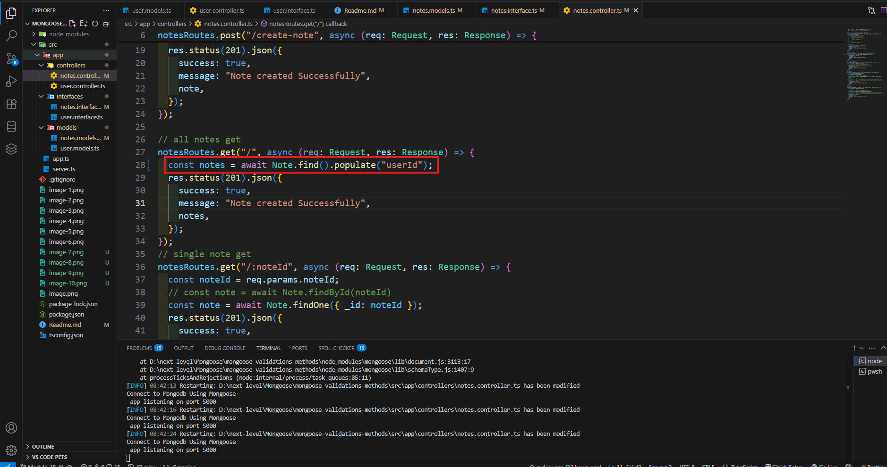

# advanced-Mongoose-Validations_Methods-Middleware-Virtual-More
GitHub Link: https://github.com/Apollo-Level2-Web-Dev/advanced-note-app-with-mongoose/tree/module-7

## 18-1 Validations in Mongoose: Built-in and Custom validations [max/min]
- **Step-1 :** age add in interface typescript

- **Step-2 :** update models


# Mongoose Built-in Validations

Mongoose provides several built-in validators to ensure the data stored in your MongoDB database is clean and conforms to your application's rules.

Below is a list of commonly used built-in validations with examples.

---

##  Built-in Validators in Mongoose

| Validator | Purpose                          | Example |
|----------|----------------------------------|---------|
| `required` | Makes the field mandatory       | `{ name: { type: String, required: true } }` |
| `minlength` | Minimum string length          | `{ name: { type: String, minlength: 3 } }` |
| `maxlength` | Maximum string length          | `{ name: { type: String, maxlength: 50 } }` |
| `min` | Minimum number value                 | `{ age: { type: Number, min: 18 } }` |
| `max` | Maximum number value                 | `{ age: { type: Number, max: 60 } }` |
| `enum` | Value must be one from a list       | `{ role: { type: String, enum: ['admin', 'user'] } }` |
| `match` | Match string using regular expression | `{ email: { type: String, match: /.+\@.+\..+/ } }` |
| `validate` | Custom validator function       | `{ age: { type: Number, validate: v => v % 2 === 0 } }` |

---

## 📌 Example Usage

```js
cimport { model, Schema } from "mongoose";
import { IUser } from "../interfaces/user.interface";

const userSchema = new Schema<IUser>({
  firstName: {
    type: String,
    required: true,
    trim: true,
    minlength:[5,"first name must be 5 characters"],
    maxlength:20
  },
  lastName: {
    type: String,
    required: true,
    trim: true,
  },
  age: {
    type: Number,
    required:true,
    min:[18, 'Must be at least 18, got {VALUE}'],
    max:60
  },
  email: {
    type: String,
    required: true,
    trim: true,
    lowercase:true,
    unique:true
  },
  password: {
    type: String,
    required: true,
  },
  role: {
    type: String,
    uppercase:true,
    enum: ["USER", "ADMIN","SUPERADMIN"],
    default: "USER",
  },
},{
  versionKey:false,
  timestamps:true
}
);

export const User = model("User", userSchema);
```

## 18-2 More About Built-in validation, Making Custom Validations & Third party Validator Package


```js
 email: {
    type: String,
    required:true,
    trim: true,
    lowercase:true,
    unique:[ true,"email common hoye gese"],
    // validate:{
    //   validator:function(value){
    //      return /^[^\s@]+@[^\s@]+\.[^\s@]+$/.test(value);
    //   },
    //   message:function(props){
    //     return `Email ${props.value} is not valid email`
    //   }
    // }
    validate:[validator.isEmail,'invalid email sent {VALUE}']
  },
  ```
  ## 18-3 Validate using Zod
```js
import express, { Request, Response } from "express";
import { User } from "../models/user.models";
import { z } from "zod";

const CreateUserZodSchema = z.object({
  firstName: z.string(),
  lastName: z.string(),
  age: z.number(),
  email: z.string(),
  password: z.string(),
  role: z.string().optional(),
});

export const userRoutes = express.Router();
userRoutes.post("/create-user", async (req: Request, res: Response) => {
try {
    const body = await CreateUserZodSchema.parse(req.body)
  console.log(body ,"zod body")
  const user = await User.create(body);
  res.status(201).json({
    success: true,
    message: "Note created Successfully",
    user:{}
  });
} catch (error:any) {
   res.status(400).json({
    success: true,
    message: error.message,
    error
  });
}
});
```
  

  ## 18-4 Embedding in Mongoose
- **step1:** first create interface
```js
export interface IAddress {
  city: string;
  street: string;
  zip: number;
}

export interface IUser {
  firstName: string;
  lastName: string;
  age: number;
  email: string;
  password: string;
  role: "USER" | "ADMIN" | "SUPERADMIN";
  address: IAddress;
}
```js
  
  - **step2:** second create schema
  ```js
  import { model, Schema } from "mongoose";
import { IAddress, IUser } from "../interfaces/user.interface";
import validator from "validator";

const addressSchema = new Schema<IAddress>({
  city: String,
  street: String,
  zip: Number,
},{
  _id:false
}
);

const userSchema = new Schema<IUser>(
  {
    firstName: {
      type: String,
      required: [true, "first name keno deo nai"],
      trim: true,
      minlength: [5, "first name must be 5 characters"],
      maxlength: 20,
    },
    lastName: {
      type: String,
      required: true,
      trim: true,
    },
    age: {
      type: Number,
      required: true,
      min: [18, "Must be at least 18, got {VALUE}"],
      max: 60,
    },
    email: {
      type: String,
      required: true,
      trim: true,
      lowercase: true,
      unique: [true, "email common hoye gese"],
      // validate:{
      //   validator:function(value){
      //      return /^[^\s@]+@[^\s@]+\.[^\s@]+$/.test(value);
      //   },
      //   message:function(props){
      //     return `Email ${props.value} is not valid email`
      //   }
      // }
      validate: [validator.isEmail, "invalid email sent {VALUE}"],
    },
    password: {
      type: String,
      required: true,
    },
    role: {
      type: String,
      uppercase: true,
      enum: {
        values: ["USER", "ADMIN", "SUPERADMIN"],
        message: "role is not valid. got {VALUE}",
      },
      default: "USER",
    },
    address: {
      type:addressSchema
    }
  },
  {
    versionKey: false,
    timestamps: true,
  }
);

export const User = model("User", userSchema);
```
  

  ## 18-5 Referencing and Population in Mongoose
  
  - **step1:** define in interface
 ```js
  import { Types } from "mongoose";
export interface notes{
title:string,
content:string,
category:string,
pinned:boolean,
tags:string,
userId:Types.ObjectId
// use:user
} 
```
  
   - **step2:** add in schema
   - there ref name same to model declired name 
   
   ```js
   // use:user
    userId:{
    type:Schema.Types.ObjectId,
    ref:"User",
    required:true
  }
  ```
   
    - **step2:** final output
   
  

## 18-6 Built-in and Custom Instance Methods in Mongoose


## 18-7 More About Instance Method
- **step1:** create interface

- **step2:** update schema 

```js
import { Model, model, Schema } from "mongoose";
import { IAddress, IUser, UserInstanceMethods } from "../interfaces/user.interface";
import validator from "validator";
import bcrypt from "bcryptjs"
const addressSchema = new Schema<IAddress>({
  city: String,
  street: String,
  zip: Number,
},{
  _id:false
}
);

const userSchema = new Schema<IUser,Model<IUser>,UserInstanceMethods>(
  {
    firstName: {
      type: String,
      required: [true, "first name keno deo nai"],
      trim: true,
      minlength: [5, "first name must be 5 characters"],
      maxlength: 20,
    },
    lastName: {
      type: String,
      required: true,
      trim: true,
    },
    age: {
      type: Number,
      required: true,
      min: [18, "Must be at least 18, got {VALUE}"],
      max: 60,
    },
    email: {
      type: String,
      required: true,
      trim: true,
      lowercase: true,
      unique: [true, "email common hoye gese"],
      // validate:{
      //   validator:function(value){
      //      return /^[^\s@]+@[^\s@]+\.[^\s@]+$/.test(value);
      //   },
      //   message:function(props){
      //     return `Email ${props.value} is not valid email`
      //   }
      // }
      validate: [validator.isEmail, "invalid email sent {VALUE}"],
    },
    password: {
      type: String,
      required: true,
    },
    role: {
      type: String,
      uppercase: true,
      enum: {
        values: ["USER", "ADMIN", "SUPERADMIN"],
        message: "role is not valid. got {VALUE}",
      },
      default: "USER",
    },
    address: {
      type:addressSchema
    }
  },
  {
    versionKey: false,
    timestamps: true,
  }
);
userSchema.method('hashPassword',async function (plainPassword:string){
  const password = await bcrypt.hash(plainPassword,10)
return password
 
})
export const User = model("User", userSchema);
```
- **step3:**  manage controllers

- **final output:**  manage controllers


## 18-8 Built-in and Custom Static Methods in Mongoose


## 18-8 Built-in and Custom Static Methods in Mongoose

- Instance method and static method can exist together.
- static method is more convenient to use more than instance method.because we do not need to create and call .save() function. we create in one line. `const user = await User.create(body);`
- Sometime we do not need any Instance to work then Static method works fine but instance method is dependent and can not work.

| Name    | Type     | Use Case                        |
| ------- | -------- | ------------------------------- |
| `model` | Function | To create a model from a schema |
| `Model` | Type     | To type your schema/model in TS |

- User Interface

```js
import { Model } from "mongoose";

export interface IAddress {
  city: string;
  street: string;
  zip: number;
}
export interface IUser {
  firstName: string;
  lastName: string;
  age: number;
  email: string;
  password: string;
  role: "USER" | "ADMIN" | "SUPERADMIN";
  address: IAddress;
}

// Custom Instance method Interface
export interface UserInstanceMethods {
  hashPassword(password: string): string;
}

// Custom Static method Interface
export interface UserStaticMethods extends Model<IUser> {
  hashPassword(password: string): string;
}
```

- User Model

```js
import { model, Model, Schema } from "mongoose";
import {
  IAddress,
  IUser,
  UserInstanceMethods,
  UserStaticMethods,
} from "../interfaces/user.interface";
import validator from "validator";
import bcrypt from "bcryptjs";

// sub schema
const addressSchema = new Schema<IAddress>(
  {
    city: { type: String },
    street: { type: String },
    zip: { type: Number },
  },
  {
    _id: false, // as it is a SUB SCHEMA we will turn off the _id so that automated mongodb id do not get inserted.
  }
);

// main schema
// for instance method
// const userSchema = new Schema<IUser, Model<IUser>, UserInstanceMethods>

// for static method ans instance method combined.if we want we can remove instance method as well
const userSchema = new Schema<IUser, UserStaticMethods, UserInstanceMethods>(
  {
    firstName: {
      type: String,
      required: [true, "First name is required."],
      trim: true,
      minlength: [
        3,
        "First name must be at least 3 characters. Got '{VALUE}'.",
      ],
      maxlength: [
        10,
        "First name must not exceed 10 characters. Got '{VALUE}'.",
      ],
    },
    lastName: {
      type: String,
      required: [true, "Last name is required."],
      trim: true,
      minlength: [3, "Last name must be at least 3 characters. Got '{VALUE}'."],
      maxlength: [
        10,
        "Last name must not exceed 10 characters. Got '{VALUE}'.",
      ],
    },
    age: {
      type: Number,
      required: [true, "Age is required."],
      min: [18, "Age must be at least 18. Got {VALUE}."],
      max: [60, "Age must not exceed 60. Got {VALUE}."],
    },
    email: {
      type: String,
      required: [true, "Email is required."],
      trim: true,
      unique: [true, "Email must be unique. Email is already in use."],
      validate: [validator.isEmail, "Provided Email Is Not Valid"],
    },
    password: {
      type: String,
      required: [true, "Password is required."],
      lowercase: true,
      minlength: [6, "Password must be at least 6 characters."],
    },
    role: {
      type: String,
      uppercase: true,
      enum: {
        values: ["USER", "ADMIN", "SUPERADMIN"],
        message: "'{VALUE}' is not a supported role.",
      },
      default: "USER",
    },
    address: {
      type: addressSchema,
    }, //using address sub schema here.
  },
  {
    versionKey: false,
    timestamps: true,
  }
);

// creating a custom instance method for hashing password.
userSchema.method("hashPassword", async function (plainPassword: string) {
  const password = await bcrypt.hash(plainPassword, 10);
  return password;
});

// creating a custom Static method for hashing password.
userSchema.static("hashPassword", async function (plainPassword: string) {
  const password = await bcrypt.hash(plainPassword, 10);
  return password;
});

// method-1 (specialized for Instance method )
// export const User = model<IUser, Model<IUser, {}, UserInstanceMethods>>(
//   "User",
//   userSchema
// );

// method-2 (specialized for Instance method as well )
export const User = model<IUser, UserStaticMethods>("User", userSchema);

```

- User Controller

```js
import { Request, Response } from "express";
// import bcrypt from "bcryptjs";
import express from "express";
import { User } from "../models/user.model";
import { z } from "zod";

export const usersRoutes = express.Router();

const createUserZodSchema = z.object({
  firstName: z.string(),
  lastName: z.string(),
  age: z.number(),
  email: z.string(),
  password: z.string(),
  role: z.string().optional(),
});
usersRoutes.post("/create-user", async (req: Request, res: Response) => {
  try {
    const zodBody = await createUserZodSchema.parseAsync(req.body);
    const body = req.body;
    // console.log("Zod Body :", body);
    // const user = await User.create(body);
    // const password = await bcrypt.hash(body.password, 10);
    // console.log(password);
    // body.password = password;

    // another method of creating a user

    // Builtin and custom instance method

    // const user = new User(body);
    // const password = await user.hashPassword(body.password);
    // console.log(password);
    // user.password = password;
    // await user.save(); // here .save() function is a instance method

    //  Builtin and Static Method

    const password = await User.hashPassword(body.password);
    body.password = password;
    const user = await User.create(body);

    res.status(201).json({
      success: true,
      message: "Users Created Successfully !",
      user,
    });
  } catch (error: any) {
    console.log(error);
    res.status(400).json({
      success: false,
      message: error.message,
      error,
    });
  }
});

usersRoutes.patch("/:userId", async (req: Request, res: Response) => {
  const userId = req.params.userId;
  const updatedUser = req.body;
  const user = await User.findByIdAndUpdate(userId, updatedUser, { new: true });

  res.status(201).json({
    success: true,
    message: "User Updated Successfully !",
    user,
  });
});

usersRoutes.get("/", async (req: Request, res: Response) => {
  const users = await User.find();

  res.status(201).json({
    success: true,
    message: "Users Retrieved Successfully !",
    users,
  });
});

usersRoutes.get("/:userId", async (req: Request, res: Response) => {
  const userId = req.params.userId;

  const user = await User.findById(userId);

  res.status(201).json({
    success: true,
    message: "User Retrieved Successfully !",
    user,
  });
});

usersRoutes.delete("/:userId", async (req: Request, res: Response) => {
  const userId = req.params.userId;
  const user = await User.findByIdAndDelete(userId);

  res.status(201).json({
    success: true,
    message: "User Deleted Successfully !",
    user,
  });
});

```

## 18-9 Middleware in Mongoose: Pre and Post Hooks


[Middleware](https://mongoosejs.com/docs/middleware.html)

- Middleware can operate in two state.(Middlewares are also called hooks)
  1. Before doing Operation (pre hook)
  2. After doing Operation (post Hook)
- Validation is one kind of pre hook middleware.

#### Types Of Middleware

- we get 4 types of mongoose middleware

  1. **Document Middleware**
     Works when doing these operations :

  - validate
  - save
  - updateOne
  - deleteOne
  - init (note: init hooks are synchronous)

  2. **Model Middleware**
     Works when doing these operations :

  - bulkWrite
  - createCollection
  - insertMany

  3. **Aggregate Middleware**

     Works when doing these operations :

  - aggregate

  1. **Query Middleware**
     Works when doing these operations :

  - count
  - countDocuments
  - deleteMany
  - deleteOne
  - estimatedDocumentCount
  - find
  - findOne
  - findOneAndDelete
  - findOneAndReplace
  - findOneAndUpdate
  - replaceOne
  - updateOne
  - updateMany
  - validate

#### Lets Make a Custom Pre and Post Hook For Our Project

- We will use pre hook for hashing a password before saving a password.
- Hooks are written in Model File

```js
import { model, Model, Schema } from "mongoose";
import {
  IAddress,
  IUser,
  UserInstanceMethods,
  UserStaticMethods,
} from "../interfaces/user.interface";
import validator from "validator";
import bcrypt from "bcryptjs";

// sub schema
const addressSchema = new Schema<IAddress>(
  {
    city: { type: String },
    street: { type: String },
    zip: { type: Number },
  },
  {
    _id: false, // as it is a SUB SCHEMA we will turn off the _id so that automated mongodb id do not get inserted.
  }
);

// main schema
// for instance method
// const userSchema = new Schema<IUser, Model<IUser>, UserInstanceMethods>

// for static method ans instance method combined.if we want we can remove instance method as well
const userSchema = new Schema<IUser, UserStaticMethods, UserInstanceMethods>(
  {
    firstName: {
      type: String,
      required: [true, "First name is required."],
      trim: true,
      minlength: [
        3,
        "First name must be at least 3 characters. Got '{VALUE}'.",
      ],
      maxlength: [
        10,
        "First name must not exceed 10 characters. Got '{VALUE}'.",
      ],
    },
    lastName: {
      type: String,
      required: [true, "Last name is required."],
      trim: true,
      minlength: [3, "Last name must be at least 3 characters. Got '{VALUE}'."],
      maxlength: [
        10,
        "Last name must not exceed 10 characters. Got '{VALUE}'.",
      ],
    },
    age: {
      type: Number,
      required: [true, "Age is required."],
      min: [18, "Age must be at least 18. Got {VALUE}."],
      max: [60, "Age must not exceed 60. Got {VALUE}."],
    },
    email: {
      type: String,
      required: [true, "Email is required."],
      trim: true,
      unique: [true, "Email must be unique. Email is already in use."],
      validate: [validator.isEmail, "Provided Email Is Not Valid"],
    },
    password: {
      type: String,
      required: [true, "Password is required."],
      lowercase: true,
      minlength: [6, "Password must be at least 6 characters."],
    },
    role: {
      type: String,
      uppercase: true,
      enum: {
        values: ["USER", "ADMIN", "SUPERADMIN"],
        message: "'{VALUE}' is not a supported role.",
      },
      default: "USER",
    },
    address: {
      type: addressSchema,
    }, //using address sub schema here.
  },
  {
    versionKey: false,
    timestamps: true,
  }
);

// creating a custom instance method for hashing password.
userSchema.method("hashPassword", async function (plainPassword: string) {
  const password = await bcrypt.hash(plainPassword, 10);
  return password;
});

// creating a custom Static method for hashing password.
userSchema.static("hashPassword", async function (plainPassword: string) {
  const password = await bcrypt.hash(plainPassword, 10);
  return password;
});

// pre hook for hashing (instead of static and instance)
userSchema.pre("save", async function () {
  this.password = await bcrypt.hash(this.password, 10);
});
userSchema.post("save", async function (doc) {
  console.log(`${doc.email} has been saved`);
});

export const User = model<IUser, UserStaticMethods>("User", userSchema);

```

- Controller file update

```js
import { Request, Response } from "express";
// import bcrypt from "bcryptjs";
import express from "express";
import { User } from "../models/user.model";
import { z } from "zod";

export const usersRoutes = express.Router();

const createUserZodSchema = z.object({
  firstName: z.string(),
  lastName: z.string(),
  age: z.number(),
  email: z.string(),
  password: z.string(),
  role: z.string().optional(),
});
usersRoutes.post("/create-user", async (req: Request, res: Response) => {
  try {
    const zodBody = await createUserZodSchema.parseAsync(req.body);
    const body = req.body;
    // console.log("Zod Body :", body);
    // const user = await User.create(body);
    // const password = await bcrypt.hash(body.password, 10);
    // console.log(password);
    // body.password = password;

    // another method of creating a user

    // Builtin and custom instance method

    // const user = new User(body);
    // const password = await user.hashPassword(body.password);
    // console.log(password);
    // user.password = password;
    // await user.save(); // here .save() function is a instance method

    //  Builtin and Static Method

    // const password = await User.hashPassword(body.password);
    // body.password = password;
    const user = await User.create(body);

    res.status(201).json({
      success: true,
      message: "Users Created Successfully !",
      user,
    });
  } catch (error: any) {
    console.log(error);
    res.status(400).json({
      success: false,
      message: error.message,
      error,
    });
  }
});


```


## 18-10 Query Middleware in Mongoose


- Suppose a scenarios is like if the user is deleted his notes will be deleted as well. we have to do it while doing query. Means we have to use query middleware.
- This Means The User will be deleted first then the notes will be deleted.


#### We have to Use `next()` in every middleware for passing fro,m one middleware to another.

```js
import { model, Model, Schema } from "mongoose";
import {
  IAddress,
  IUser,
  UserInstanceMethods,
  UserStaticMethods,
} from "../interfaces/user.interface";
import validator from "validator";
import bcrypt from "bcryptjs";
import { Note } from "./note.model";

// sub schema
const addressSchema = new Schema<IAddress>(
  {
    city: { type: String },
    street: { type: String },
    zip: { type: Number },
  },
  {
    _id: false, // as it is a SUB SCHEMA we will turn off the _id so that automated mongodb id do not get inserted.
  }
);

// main schema
// for instance method
// const userSchema = new Schema<IUser, Model<IUser>, UserInstanceMethods>

// for static method ans instance method combined.if we want we can remove instance method as well
const userSchema = new Schema<IUser, UserStaticMethods, UserInstanceMethods>(
  {
    firstName: {
      type: String,
      required: [true, "First name is required."],
      trim: true,
      minlength: [
        3,
        "First name must be at least 3 characters. Got '{VALUE}'.",
      ],
      maxlength: [
        10,
        "First name must not exceed 10 characters. Got '{VALUE}'.",
      ],
    },
    lastName: {
      type: String,
      required: [true, "Last name is required."],
      trim: true,
      minlength: [3, "Last name must be at least 3 characters. Got '{VALUE}'."],
      maxlength: [
        10,
        "Last name must not exceed 10 characters. Got '{VALUE}'.",
      ],
    },
    age: {
      type: Number,
      required: [true, "Age is required."],
      min: [18, "Age must be at least 18. Got {VALUE}."],
      max: [60, "Age must not exceed 60. Got {VALUE}."],
    },
    email: {
      type: String,
      required: [true, "Email is required."],
      trim: true,
      unique: [true, "Email must be unique. Email is already in use."],
      validate: [validator.isEmail, "Provided Email Is Not Valid"],
    },
    password: {
      type: String,
      required: [true, "Password is required."],
      lowercase: true,
      minlength: [6, "Password must be at least 6 characters."],
    },
    role: {
      type: String,
      uppercase: true,
      enum: {
        values: ["USER", "ADMIN", "SUPERADMIN"],
        message: "'{VALUE}' is not a supported role.",
      },
      default: "USER",
    },
    address: {
      type: addressSchema,
    }, //using address sub schema here.
  },
  {
    versionKey: false,
    timestamps: true,
  }
);

// creating a custom instance method for hashing password.
userSchema.method("hashPassword", async function (plainPassword: string) {
  const password = await bcrypt.hash(plainPassword, 10);
  return password;
});

// creating a custom Static method for hashing password.
userSchema.static("hashPassword", async function (plainPassword: string) {
  const password = await bcrypt.hash(plainPassword, 10);
  return password;
});

// pre hook for hashing (instead of static and instance)
userSchema.pre("save", async function (next) {
  this.password = await bcrypt.hash(this.password, 10);
  next();
});
userSchema.post("save", async function (doc, next) {
  console.log(`${doc.email} has been saved`);
  next();
});

//query middleware pre

userSchema.pre("find", async function (next) {
  console.log("Wow Pre Query Middleware");
  next();
});

//query middleware post
userSchema.post("findOneAndDelete", async function (doc, next) {
  if (doc) {
    console.log(doc);
    await Note.deleteMany({ user: doc._id });
  }
  next();
});

//

// method-1 (specialized for Instance method )
// export const User = model<IUser, Model<IUser, {}, UserInstanceMethods>>(
//   "User",
//   userSchema
// );

// method-2 (specialized for Instance method as well )
export const User = model<IUser, UserStaticMethods>("User", userSchema);

```
## 18-11 Using Virtuals in Mongoose


```js
import { Model, model, Schema } from "mongoose";
import { IAddress, IUser, UserInstanceMethods, UserStaticMethods } from "../interfaces/user.interface";
import validator from "validator";
import bcrypt from "bcryptjs"
import { Note } from "./notes.models";
const addressSchema = new Schema<IAddress>({
  city: String,
  street: String,
  zip: Number,
},{
  _id:false
}
);

const userSchema = new Schema<IUser,UserStaticMethods,UserInstanceMethods>(
  {
    firstName: {
      type: String,
      required: [true, "first name keno deo nai"],
      trim: true,
      minlength: [5, "first name must be 5 characters"],
      maxlength: 20,
    },
    lastName: {
      type: String,
      required: true,
      trim: true,
    },
    age: {
      type: Number,
      required: true,
      min: [18, "Must be at least 18, got {VALUE}"],
      max: 60,
    },
    email: {
      type: String,
      required: true,
      trim: true,
      lowercase: true,
      unique: [true, "email common hoye gese"],
      // validate:{
      //   validator:function(value){
      //      return /^[^\s@]+@[^\s@]+\.[^\s@]+$/.test(value);
      //   },
      //   message:function(props){
      //     return `Email ${props.value} is not valid email`
      //   }
      // }
      validate: [validator.isEmail, "invalid email sent {VALUE}"],
    },
    password: {
      type: String,
      required: true,
    },
    role: {
      type: String,
      uppercase: true,
      enum: {
        values: ["USER", "ADMIN", "SUPERADMIN"],
        message: "role is not valid. got {VALUE}",
      },
      default: "USER",
    },
    address: {
      type:addressSchema
    }
  },
  {
    versionKey: false,
    timestamps: true,
    toJSON:{virtuals:true},
    toObject:{virtuals:true}
  }
);
userSchema.method('hashPassword',async function (plainPassword:string){
  const password = await bcrypt.hash(plainPassword,10)
return password
 
})
userSchema.static('hashPassword',async function (plainPassword:string){
  const password = await bcrypt.hash(plainPassword,10)
return password
})
// document middleware
userSchema.pre("save",async function(){
  console.log("inside pre save hook");
  this.password =await bcrypt.hash(this.password,10)
  console.log(this)
})

// document middleware
userSchema.post('save', function(doc,next) {
  console.log('%s has been saved', doc._id);
  next()
});
// query middleware
userSchema.pre("find",function(next){
 console.log("inside pre find hook")
  next()
}) 

// post hook
// query middleware
userSchema.post("findOneAndDelete",async function (doc,next){
  if(doc){
    console.log(doc);
    await Note.deleteMany({userId:doc._id})

  }
      next()
})
userSchema.virtual("fullName").get(function(){
  return `${this.firstName} ${this.lastName}`
})
export const User = model<IUser,UserStaticMethods>("User", userSchema);
```

## 18-12 Filter, Sort, Skip, Limit in Mongoose And Module Summary

- specific user query by email
```js
userRoutes.get("/", async (req: Request, res: Response) => {
  const userEmail= req.query.email? req.query.email:"";
  console.log(userEmail)
  let users =[]

  if(userEmail){
     users = await User.find({email:userEmail});
  }else{
     users = await User.find();
  }

  res.status(201).json({
    success: true,
    message: "Note created Successfully",
    users,
  });
});
```

#####  sort

```js
 users = await User.find().sort({"email":"asc"})
 users = await User.find().sort({"email":1})
 ```

 #### skipping
 ```js
  users = await User.find().skip(6)
```
```js
// ====================limiting======================
 users = await User.find().limit(2)
 ```

 ```js
 userRoutes.get("/", async (req: Request, res: Response) => {
  const userEmail= req.query.email? req.query.email:"";
  console.log(userEmail)
  let users =[]
//======================filtering========================
  // if(userEmail){
  //    users = await User.find({email:userEmail});
  // }else{
  //    users = await User.find();
  // }
// =====================sorting====================
//  users = await User.find().sort({"email":"asc"})
//  users = await User.find().sort({"email":1})
// ====================skipping======================
//  users = await User.find().skip(6)
// ====================limiting======================
 users = await User.find().limit(2)
  res.status(201).json({
    success: true,
    message: "Note created Successfully",
    users,
  });
});
```
